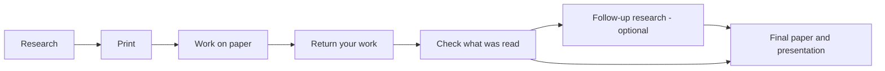

# Workflow map and gap report

Deliverable of the end-to-end workflow clarity pass (2026-07-13), kept
current with the implementation. Naming rules and per-surface copy live in
`docs/brand/UI-COPY-MAP.md`; architecture facts in `docs/ARCHITECTURE.md`.

## The single workflow (research packet)

A research-packet project moves through seven stages. The stage is
**derived** client-side from domain data (`src/lib/journey.ts`) — there is
no separate stage column to drift out of sync.

| Stage | User sees | System does | Cost | Where |
| --- | --- | --- | --- | --- |
| Research | "Gathering sources" → "Building your packet" | Parallel deep research → packet agent → `packets`/`packet_questions` | 2 credits | `/new`, run page |
| Review questions | "Ready for your review" — edit / lock / add / approve | Owner-editable question rows under RLS | free | `/packet/$runId` |
| Print | US Letter packet with response areas, MARKUP legend, return instructions | `buildPacketPrintDocument`, browser print dialog | free | `/print/$runId` |
| Work on paper | (off-screen) printed instructions explain how to come back | — | free | printed packet |
| Return your work | photos and/or dictation, as equals | quality gate → multimodal recognition → `recognized_blocks`/`dictation_segments` | free | `/return/$runId` |
| Check what was read | photo beside recognized text, corrections, explicit approval | `verification_corrections`; consent-gated handwriting profile | free | `/verify/$runId` |
| Follow-up research (optional) | up to 3 questions, visible refinement, or explicit skip | one Parallel pass → revised packet `version = n+1` with "What changed" | 2 credits | project hub |
| Final paper & presentation | generate, then download any number of times | contribution model → LLM synthesis → `.docx`/`.pptx` in `final-artifacts` bucket | 1 credit each | project hub |

The longform workflow is unchanged: research/paste → proposal → resynth /
ready / revise, all on the run page. Both workflows share the dashboard's
project list; `projectStageLabel` names the stage per workflow.

At every stage the project hub (`/projects/$pieceId`) answers the five
questions the clarity brief demanded: where am I (journey rail), what is
the system doing (activity labels), what do I need to do (one primary
action), what happens next (transition copy at each boundary), and what
the final result is (the artifacts panel).

## Gap report

### Gaps found by the audit, now closed

| Gap | Resolution |
| --- | --- |
| Printed packet promised a return flow that did not exist | Return loop built: `packet-return` function, `/return/$runId`, `/verify/$runId`; printed instructions rewritten to match the real flow |
| No path from returned work to a better packet | Follow-up research (`packet-action`, `followup_questions`, revised packet chain) |
| Workflow dead-ended with no final deliverable | `final-artifacts` function producing Final paper (.docx) and Class presentation (.pptx) |
| Professors had no way to assign or observe | Minimal professor layer: courses with join codes, assignments, roster progress, course-scoped RLS |
| Dashboard listed raw runs with machine statuses | Project-centric dashboard + project hub + humanized `StatusPill` |
| Users could not tell what a credit buys | What-credits-buy table on `/billing`, cost stated before every dispatch, free actions named |
| Jargon in primary copy (OCR, artifact, ingestion) | Naming system in `docs/brand/UI-COPY-MAP.md`, implemented in `src/lib/journey.ts` |

### Decisions that removed choices (simplification by design)

- The revised packet renders as **one document with a "What changed"
  section** — no user-facing choice among full/addendum/replacement-page
  formats.
- Follow-up research is optional but **skipping is explicit**, so the final
  artifacts never silently omit it.
- Photos and dictation are equal return paths; there is no "primary" mode
  to configure.

### Known remaining gaps (accepted, documented)

- **Document visuals are native tables/structured comparisons** — generated
  chart images are out of scope for artifact generation.
- **Professor layer is minimal**: no per-assignment config matrix
  enforcement beyond topic/question count, no professor editing of student
  questions pre-print (professors review through the existing packet
  surface).
- **No frontend component test suite** — journey derivation is covered by
  `tests/journey.test.ts`; route rendering is validated by
  lint + typecheck + build + manual viewport checks.
- **Supabase generated types lag the new tables** until regenerated after
  migrations apply (`docs/RUNBOOK.md`, rollout step 5); affected client
  libs carry local casts.
- **Handwriting adaptation is minimal**: a consent-gated profile row built
  from confirmed corrections, used as prompt context; no model
  fine-tuning.
