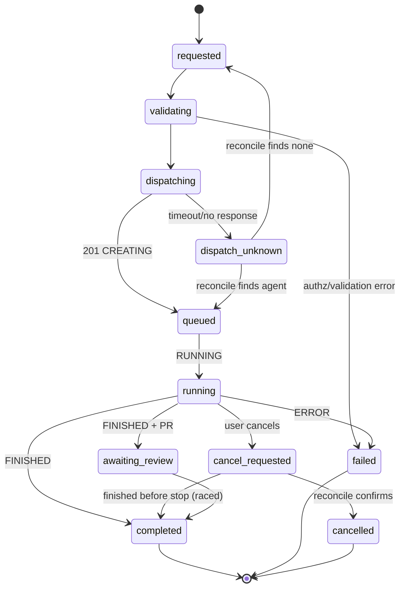

# Integration Contract Design Review: Lovable Cloud ↔ Cursor Managed (Cloud) Agents

*Principal-architect design review. Audience: Senior Staff Engineer. Confidence taxonomy — **Documented** / **Strongly implied** / **Unknown** / **Contradicted** — is preserved throughout. "Not established by supplied documentation" marks silence; "Application-owned design decision" marks proposed behavior neither vendor specifies.*

---

## 1. Executive Conclusion

**A viable, supportable internal contract can be defined — but only if Lovable acts strictly as the control plane and system of record, and Cursor acts strictly as the execution plane.** The integration must be an application-owned adapter over Cursor's documented `/v0/agents` REST surface plus its `statusChange` webhook, with Supabase Postgres as the durable state store and a scheduled reconciliation loop as the authoritative status mechanism. No part of the design may depend on undocumented Cursor behavior.

- **Recommended boundary:** Lovable owns identity, server-side authorization, the canonical job record, idempotency, retries, reconciliation, audit, the webhook receiver, and the user-facing state machine. Cursor owns repository cloning, remote code execution in isolated VMs, branch/PR creation, terminal status, and artifacts.
- **Control vs execution plane:** **Lovable = control plane** (and execution plane for *its own* orchestration logic running in Edge Functions). **Cursor = execution plane** for coding work. Lovable must NOT try to be the execution plane for the agent; Cursor must NOT be treated as the source of truth for application state.
- **Three most serious unresolved risks:**
  1. **No documented idempotency mechanism** on agent creation (confirmed absent across `endpoints`, `api`, `webhooks`, and the changelog). Duplicate-agent creation during ambiguous dispatch is a real, unmitigated-by-vendor risk.
  2. **Webhooks are at-least-once with retries and no ordering or exactly-once guarantee**, and only `statusChange` for `ERROR`/`FINISHED` exists — there are **no progress events** in v0.
  3. **The first-party docs are mid-migration** between a v0 agent-based API (the schemas actually rendered) and a v1 run-based API (named in the API sidebar and the SDK changelog). Schema stability across this transition is not guaranteed.
- **Three highest-confidence integration primitives:**
  1. `POST /v0/agents` returns a durable agent id (`bc_...`) synchronously with `status: "CREATING"` (HTTP 201).
  2. `GET /v0/agents/{id}` returns current status plus `target.branchName`/`target.prUrl` for polling-based reconciliation.
  3. HMAC-SHA256-signed `statusChange` webhooks: per Cursor's Webhooks docs, `X-Webhook-Signature` "Contains the HMAC-SHA256 signature in the format `sha256=<hex_digest>`", with `X-Webhook-ID`, `X-Webhook-Event`, and `User-Agent` "Always set to `Cursor-Agent-Webhook/1.0`".

---

## 2. Source Inventory

**Cursor (first-party, cursor.com/docs & changelog):**
- `cloud-agent/api/endpoints` — v0 endpoints and request/response schemas for Launch (`POST /v0/agents`), Follow-up (`/followup`), Status (`GET /v0/agents/{id}`), Stop (`/stop`), Delete, Artifacts. Establishes the `/v0/agents` surface and the `bc_...` id format.
- `cloud-agent/api/webhooks` — `statusChange` event, header set, HMAC-SHA256 signature scheme, raw-body requirement, retry-on-non-2xx note.
- `docs/api` — auth (Basic `-u KEY:` **and** `Authorization: Bearer`), key format `crsr_...`, error shapes (400/401/403/404/429/500). Verbatim: **"Rate limits are enforced per team and reset every minute."** ETag caching: **"Cache duration: 15 minutes (Cache-Control: public, max-age=900)"** and **"304 responses don't count against rate limits."**
- `changelog/sdk-release` (Apr 2026) — v1 rework to "durable agents and per-prompt runs," run-scoped follow-ups/status/streaming/cancellation, SSE with `Last-Event-ID` reconnect, archive/unarchive/delete, "structured error codes, `items` list responses, and separate `agent`/`run` objects."
- `cloud-agent/security-network` — isolated VMs in Cursor's AWS; secret types Environment Variable / Runtime Secret (redacted `[REDACTED]`) / Build Secret; HSM-backed Ed25519 signed commits; three egress modes + allowlist.
- `cloud-agent/settings` — network access modes; base branch; **team follow-up privilege-escalation warning** (a follow-up can run with another user's secrets/credentials).
- `cloud-agent/best-practices`, `cloud-agent/self-hosted-cloud-run` — Secrets tab, egress allowlist, private workers/fleet summary.

**Lovable (first-party, docs.lovable.dev & lovable.dev):**
- `integrations/cloud` — Lovable Cloud "utilizes Supabase's open-source foundation"; per-project isolated Supabase project; Secrets manager is backend-only with reserved `SUPABASE_`/`LOVABLE_` prefixes; Edge Functions; Storage up to 2 GB, public buckets blocked by default; daily DB backups retained ~14 days; region locked after enable.
- `lovable.dev/blog/a-founders-guide-to-lovable-security` — project-level isolation ("a vulnerability in one customer's application cannot propagate to another"); Edge Functions "JWT-protected by default." Verbatim: **"Secrets are AES-GCM encrypted at the field level before storage, managed through Google Cloud KMS with workspace-scoped key rings that provide isolation between tenants... never returned in plaintext through the API."**

**Supabase (first-party, supabase.com/docs — underpins Lovable Cloud):**
- `functions/limits` — CPU 2s; request idle timeout 150s (else 504); wall clock limit; bundle 20MB; ports 25/587 blocked; no Web Worker/Node vm API.
- `functions/background-tasks` — `EdgeRuntime.waitUntil()`, `beforeunload` event; free 150s / paid 400s background limit.
- `troubleshooting/edge-function-shutdown-reasons-explained` — wall clock "Currently set at 400 seconds"; CPU "Currently limited to 2000 milliseconds"; **"EdgeRuntime.waitUntil() prevents early retirement, but it does not extend the hard wall clock limit."**
- `functions/secrets` — auto-injected env vars; `SUPABASE_SERVICE_ROLE_KEY` "should NEVER be used in a browser... will bypass Row Level Security"; reserved `SUPABASE_` prefix.
- `database/postgres/row-level-security` — `auth.uid()`, service-role bypass, UPDATE requires a SELECT policy, RLS-enabled-no-policy = inaccessible.
- `realtime/postgres-changes`, `/broadcast`, `/authorization` — Realtime respects RLS; **"If you expect more than ~3,000 concurrent subscribers on the same changes, use Broadcast"**; private channels need RLS on `realtime.messages`; database-broadcast messages retained ~3 days (72h–4d window).

---

## 3. Cursor Capability Map

| Capability | Documented behavior | Endpoint/mechanism | Input | Output | Auth | Limits | Lifecycle | Errors | Security | Confidence |
|---|---|---|---|---|---|---|---|---|---|---|
| Launch agent | Start cloud agent on repo | `POST /v0/agents` | `prompt.text` (req), `source.repository`+`source.ref` (or `source.prUrl`), `target.autoCreatePr`, `target.branchName`, `model`, `webhook.url`/`webhook.secret` (≥32 chars) | `{id:"bc_abc123", name, status:"CREATING", source, target.{branchName,url,prUrl}, createdAt}` (201) | Basic or Bearer `crsr_...` | "Standard rate limiting"; per-team, resets/min (no published numeric for create) | Durable agent | 400/401/403/429/500 | Runs in isolated VM, Cursor AWS | **Documented** |
| Get status | Current status + results | `GET /v0/agents/{id}` | id | status, source, `target.prUrl/branchName`, `summary` | same | standard | — | 404 | — | **Documented** |
| Follow-up | Add instruction to existing agent | `POST /v0/agents/{id}/followup` | `prompt.text` | agent object | same | one active run/agent; **409 `agent_busy`** | continues run | 400/409 | Team follow-ups can escalate privilege | **Documented**; 409 **Strongly implied** (changelog/SDK) |
| Stop | "pauses the agent's execution without deleting it" | `POST /v0/agents/{id}/stop` | id | — | same | standard | pausable, resumable via follow-up | — | — | **Documented** |
| Delete | "permanent and cannot be undone"; removes transcript + artifacts | `DELETE /v0/agents/{id}` | id | — | same | standard | terminal | — | data erasure | **Documented** |
| List agents | List agents for user | `GET /v0/agents` | pagination | items[] | same | standard | — | — | — | **Documented** |
| List artifacts | "created within the last 6 months" | `GET /v0/agents/{id}/artifacts` | id | artifact list | same | **300/min, 6000/hr** | — | — | 15-min presigned S3 URLs | **Documented** |
| List repos | GitHub repos accessible | `GET /v0/repositories` | — | repos | same | **1/user/min, 30/user/hr** | — | — | via Cursor GitHub app | **Documented** |
| Webhook `statusChange` | "only `statusChange` events are supported, specifically when an agent encounters an `ERROR` or `FINISHED` state" | agent `webhook.url` | — | `{event,timestamp,id,status,source,target,summary}` + headers | HMAC-SHA256 shared secret | at-least-once; "Webhooks may be retried if your endpoint returns an error status code" | fires on terminal | — | verify raw-body signature | **Documented** |
| Progress/streaming | No progress webhook in v0; SSE run streaming exists in v1/SDK w/ `Last-Event-ID` | `Stream A Run` (v1)/SDK | — | SSE events | same | — | — | — | — | **Strongly implied** (v1 changelog); v0 progress webhook **Contradicted** |
| Idempotency key / `Idempotency-Key` header | — | — | — | — | — | — | — | — | — | **Not established by supplied documentation** (confirmed absent) |
| Status enum | `CREATING`, `RUNNING`, `FINISHED`, `ERROR` appear in examples | — | — | — | — | — | — | — | — | **Documented** (partial). `CANCELLED`/`EXPIRED`/`PENDING` **Not established** |
| Base commit SHA on create | — | — | — | create response returns branch/url, not fork SHA | — | — | — | — | — | **Not established** |

*Version note:* The rendered `endpoints` schema is **v0** (`/v0/agents`, OpenAPI 0.1.0, `operationId: createAgent`). The v1 run-based endpoints (Create/Get/Stream/Cancel A Run, Archive/Unarchive) are **named** in the `docs/api` sidebar and the changelog but their detailed schemas are **not established** in retrievable first-party content. Build against v0; treat v1 as a forward-compat concern.

---

## 4. Lovable Capability Map (including Supabase Edge Functions underpinnings)

| Capability | Documented behavior | Mechanism | Auth | Limits | Errors | Persistence | Security | Confidence |
|---|---|---|---|---|---|---|---|---|
| Edge Function | Serverless Deno TS; secrets auto-injected | Supabase Edge Function | JWT-protected by default | CPU 2s; idle→504 at 150s; wall clock 400s; bundle 20MB | 504 idle | stateless | Deno sandbox; no host env in User Workers | **Documented** |
| Background task | Continue after response | `EdgeRuntime.waitUntil()`; `beforeunload` | — | free 150s / paid 400s; **does NOT extend hard wall clock** | terminated at limit | ephemeral `/tmp` | — | **Documented** |
| Secrets | Backend-only encrypted env vars, injected to functions | Cloud→Secrets; `Deno.env.get()` | service-managed | reserved `SUPABASE_`/`LOVABLE_`; no `VITE_` | — | AES-GCM field-encrypted, GCloud KMS, workspace-scoped key rings | never to browser | **Documented** |
| Service role key | Bypasses RLS; server-side only | `SUPABASE_SERVICE_ROLE_KEY` | — | — | — | — | must never reach browser | **Documented** |
| Database | Isolated Postgres per project | Supabase Postgres | RLS | instance-size dependent | — | daily backup ~14 days | project-level isolation | **Documented** |
| RLS | Row-level authz; `auth.uid()`; UPDATE needs SELECT policy | Postgres policies | authenticated/anon | perf without index | empty result if no policy | — | defense in depth | **Documented** |
| Auth | Email, phone, Google OAuth 2.0 | Lovable Cloud Auth (Supabase) | JWT | — | — | — | — | **Documented** |
| Realtime (Postgres Changes) | Streams row changes; respects RLS | `postgres_changes` | RLS on table | authz per subscriber; **>3000 subs → Broadcast** | — | — | SELECT policy governs delivery | **Documented** |
| Realtime (Broadcast) | Low-latency msgs; DB trigger `broadcast_changes` | private channel + RLS on `realtime.messages` | RLS | DB-broadcast msgs retained ~3 days (72h–4d) | — | daily partitions | private channels require RLS | **Documented** |
| Storage | Files ≤2 GB; private by default | buckets | RLS on storage.objects | public buckets blocked by default | — | — | — | **Documented** |
| Scheduled invocation (cron) | Lovable lists "Scheduled tasks" as an Edge Function use case | Edge Functions / pg_cron (Supabase) | — | not fully specified in Lovable docs | — | — | — | **Strongly implied** (Lovable lists it; pg_cron is a Supabase primitive — exact guarantees **Not established**) |
| Outbound HTTP | `fetch()` to external HTTPS | Deno fetch | — | ports 25/587 blocked | — | — | — | **Documented** |

---

## 5. Compatibility Matrix

| Approach | Verdict | Rationale |
|---|---|---|
| Direct REST from Edge Function → `api.cursor.com` | **Confirmed compatible** | Deno `fetch()` over HTTPS; create returns synchronously; well within CPU 2s / 150s idle. |
| Run `@cursor/sdk` inside Lovable/Supabase runtime | **Unsupported / Not verifiable** | SDK is a Node package (Node 18/22); Supabase runs a custom Deno runtime, not Node. First-party docs do not establish Deno compatibility. Use REST. |
| Cursor SDK in a separate Node service | **Possible but not recommended** | No documented need; adds an operational plane. Justified only if v1 SSE streaming becomes required and Deno cannot consume it reliably — not yet established. |
| Cursor-managed remote execution + Lovable control plane | **Confirmed compatible — recommended** | Matches the documented model: Cursor runs in its own VMs; Lovable orchestrates via REST + webhook + reconciliation. |
| Webhook receipt in a Lovable Function | **Confirmed compatible with adapter** | Must read raw body for HMAC verification and disable JWT verification on the receiver (Cursor sends no Supabase JWT). |
| Long-running synchronous wait for completion in a Function | **Incompatible with documented runtime constraints** | Agent runs take minutes–hours; hard wall clock is 400s and idle timeout 150s. Completion must be async (webhook + polling). |

---

## 6. Proposed System Boundary

**Lovable owns:** user authentication; project/repo/branch authorization resolved **server-side**; the canonical job record and lifecycle state machine; idempotency and duplicate suppression; the Cursor API key (backend secret); retry/backoff policy; the reconciliation loop; the audit log; the webhook receiver; frontend state via Realtime; and cost/usage controls (per-tenant job caps).

**Cursor owns:** repository clone; remote code execution in an isolated VM; branch creation; PR creation (best-effort); agent/run terminal status; artifacts; commit signing.

**Neither owns automatically:** CI outcome, code review, merge, deployment, business success — all downstream of PR creation and explicitly out of the contract's scope.

---

## 7. Canonical Integration Contract

The supplied interface is improved: (a) `createJob` returns an explicit `dispatchState` to model ambiguous dispatch; (b) `continueJob` is gated on the single-active-run constraint (409 `agent_busy`); (c) `reconcileJob` is the authoritative status path; (d) every external status is retained raw for forward-compatibility.

```ts
type LifecycleState =
  | "requested" | "validating" | "dispatching" | "dispatch_unknown"
  | "queued" | "running" | "awaiting_review"
  | "completed" | "failed" | "cancel_requested" | "cancelled"
  | "reconciliation_required";

interface ManagedAgentJob {
  internalJobId: string;              // app-owned UUID (PK)
  correlationId: string;              // app-owned trace id
  idempotencyKey: string;             // app-owned (Cursor exposes none)
  externalAgentId: string | null;     // Cursor bc_... id
  externalRunId: string | null;       // v1 run id when available; else null
  repository: string;                 // resolved server-side
  baseBranch: string | null;
  baseCommitSha: string | null;       // Not established from create response
  agentBranch: string | null;         // target.branchName
  pullRequestUrl: string | null;      // target.prUrl
  requestedModel: string | null;
  lifecycleState: LifecycleState;     // app-owned canonical
  externalRawStatus: string | null;   // CREATING|RUNNING|FINISHED|ERROR|<unknown>
  createdAt: string;
  lastReconciledAt: string | null;
  completedAt: string | null;
  errorCategory: "none" | "validation" | "rate_limit" | "transient" | "permanent" | "unknown";
  retryable: boolean;
  cancellationStatus: "none" | "requested" | "confirmed" | "raced";
  usage: { tokens?: number } | null;  // only if exposed
  lastWebhookEventId: string | null;  // X-Webhook-ID dedupe
  rawVendorPayloadRef: string | null; // FK → agent_events
  tenantId: string;                   // owning project/workspace
}

interface CreateManagedAgentJobInput {
  tenantId: string; userId: string; projectId: string;
  taskPrompt: string; requestedModel?: string;
  idempotencyKey: string; correlationId: string;
}
interface CreateManagedAgentJobResult {
  job: ManagedAgentJob;
  dispatchState: "dispatched" | "dispatch_unknown" | "duplicate_suppressed";
}
interface ContinueManagedAgentJobResult {
  accepted: boolean; reason?: "agent_busy" | "terminal"; job: ManagedAgentJob;
}
interface HandleManagedAgentWebhookInput {
  rawBody: Uint8Array; signature: string; webhookEventId: string; eventType: string;
}
interface WebhookProcessingResult {
  status: "applied" | "duplicate_ignored" | "unknown_agent" | "invalid_signature";
}

interface ManagedCodingAgentProvider {
  createJob(i: CreateManagedAgentJobInput): Promise<CreateManagedAgentJobResult>;
  getJob(i: { internalJobId: string }): Promise<ManagedAgentJob>;
  cancelJob(i: { internalJobId: string }): Promise<{ requested: boolean; job: ManagedAgentJob }>;
  continueJob(i: { internalJobId: string; prompt: string }): Promise<ContinueManagedAgentJobResult>;
  reconcileJob(i: { internalJobId: string }): Promise<ManagedAgentJob>;
  handleWebhook(i: HandleManagedAgentWebhookInput): Promise<WebhookProcessingResult>;
}
```

---

## 8. Lifecycle State Machine

**State table.** Grounded (Cursor-documented) statuses: `CREATING`, `RUNNING`, `FINISHED`, `ERROR`. Everything else is an **Application-owned design decision**.

| State | Entry | Exit | Terminal? | Retryable? | Persisted fields | User meaning | Cursor mapping | Recovery after interruption |
|---|---|---|---|---|---|---|---|---|
| requested | row inserted | →validating | no | n/a | idem key, prompt | "Received" | — | reprocess from row |
| validating | authz/repo resolution | →dispatching / →failed | no | n/a | repo, branch | "Preparing" | — | re-run authz |
| dispatching | about to POST | →queued / →dispatch_unknown | no | no | — | "Starting" | — | see dispatch_unknown |
| dispatch_unknown | POST timed out / crashed pre-persist | →queued / →requested | no | **no (blind)** | correlationId | "Starting…" | — | reconcile: list agents/match before any retry |
| queued | 201 received | →running | no | n/a | externalAgentId | "Queued" | `CREATING` | GET status |
| running | RUNNING observed | →awaiting_review/completed/failed/cancel_requested | no | n/a | — | "Working" | `RUNNING` | GET status |
| awaiting_review | FINISHED + PR | →completed | no | n/a | prUrl | "Review PR" | `FINISHED` | GET status |
| completed | FINISHED | — | **yes** | no | summary, branch | "Done" | `FINISHED` | idempotent |
| failed | ERROR | — | **yes** | maybe (new job) | error | "Failed" | `ERROR` | idempotent |
| cancel_requested | user cancels; Stop sent | →cancelled/completed | no | n/a | cancellationStatus | "Cancelling" | Stop (no status) | reconcile |
| cancelled | reconcile confirms stopped | — | **yes** | no | — | "Cancelled" | **Not established** | idempotent |
| reconciliation_required | drift detected | →any | no | n/a | — | (internal) | — | run reconciler |

**Ambiguous dispatch.** Because Cursor documents **no idempotency key**, a create call that times out cannot be safely retried. The job enters `dispatch_unknown`; recovery is: reconcile (list/get, match on correlation metadata) **before** any retry. Duplicate-agent creation is an **unresolved design risk** — see §12/§17 for application-level mitigations. **Forward-compat rule:** any `externalRawStatus` not in the known set maps to a non-terminal hold, never silently to a terminal state.



---

## 9. Sequence Diagrams

**Successful creation**
```mermaid
sequenceDiagram
  participant FE as Lovable Frontend
  participant EF as Edge Function
  participant DB as Postgres
  participant CU as Cursor API
  FE->>EF: createJob(prompt) + JWT
  EF->>DB: authz via RLS; insert job(dispatching), unique(idempotencyKey)
  EF->>CU: POST /v0/agents (webhook.url + secret)
  CU-->>EF: 201 {id: bc_..., CREATING}
  EF->>DB: persist externalAgentId, state=queued
  EF-->>FE: job(queued)
```

**Webhook-driven completion**
```mermaid
sequenceDiagram
  participant CU as Cursor
  participant WH as Webhook EF (JWT disabled)
  participant DB as Postgres
  participant RT as Realtime
  CU->>WH: POST statusChange (raw body, X-Webhook-Signature)
  WH->>WH: HMAC-SHA256 verify on raw body
  WH->>DB: dedupe X-Webhook-ID; apply terminal state monotonically
  DB->>RT: row change → private channel (RLS)
```

**Polling reconciliation**
```mermaid
sequenceDiagram
  participant CR as Cron EF
  participant DB as Postgres
  participant CU as Cursor
  CR->>DB: select non-terminal jobs where lastReconciledAt old
  CR->>CU: GET /v0/agents/{id}
  CU-->>CR: status + prUrl/branch
  CR->>DB: reconcile state; set lastReconciledAt
```

**Ambiguous-dispatch recovery, cancellation, follow-up, Cursor failure, and Function timeout** all follow the same invariant: **the DB is the source of truth, the webhook is a best-effort optimization, and the cron reconciler is authoritative.** For ambiguous dispatch, the reconciler lists agents and matches correlation metadata before permitting any new create. For cancellation, `POST /v0/agents/{id}/stop` is fire-and-confirm — the terminal `cancelled` state is set only after reconciliation, because a CANCELLED status is **not established** in the docs.

---

## 10. Persistence Model

```sql
create table agent_jobs (
  internal_job_id uuid primary key default gen_random_uuid(),
  tenant_id uuid not null,
  user_id uuid not null,
  project_id uuid not null,
  idempotency_key text not null,
  correlation_id text not null,
  external_agent_id text,
  external_run_id text,
  repository text not null,
  base_branch text,
  base_commit_sha text,
  agent_branch text,
  pull_request_url text,
  requested_model text,
  lifecycle_state text not null default 'requested',
  external_raw_status text,
  error_category text not null default 'none',
  retryable boolean not null default false,
  cancellation_status text not null default 'none',
  usage jsonb,
  last_webhook_event_id text,
  created_at timestamptz not null default now(),
  last_reconciled_at timestamptz,
  completed_at timestamptz,
  constraint uq_idem unique (tenant_id, idempotency_key)
);
create index idx_jobs_open on agent_jobs (lifecycle_state, last_reconciled_at)
  where lifecycle_state not in ('completed','failed','cancelled');
create index idx_jobs_agent on agent_jobs (external_agent_id);

create table agent_events (
  id uuid primary key default gen_random_uuid(),
  internal_job_id uuid references agent_jobs,
  webhook_event_id text,
  event_type text,
  raw_payload jsonb not null,          -- verbatim body for audit/forward-compat
  received_at timestamptz not null default now(),
  constraint uq_webhook unique (internal_job_id, webhook_event_id)
);

create table repo_allowlist (
  tenant_id uuid not null,
  project_id uuid not null,
  repository text not null,
  base_branch text not null,
  primary key (tenant_id, project_id, repository)
);
```

- **Idempotency (Application-owned):** unique `(tenant_id, idempotency_key)`; the row is inserted in `dispatching` **before** the external call, so a duplicate submission collides on the constraint and is suppressed. This substitutes for the missing vendor idempotency key.
- **Event log:** `agent_events` with `unique(internal_job_id, webhook_event_id)` gives webhook dedupe on `X-Webhook-ID` and an audit trail.
- **Raw-payload retention:** verbatim JSON preserved for forward-compat against schema/status drift.
- **Tenant isolation:** RLS on all three tables keyed on `tenant_id`; service role used only inside Edge Functions.

---

## 11. Authentication and Authorization Model

- **User authentication:** Lovable Cloud Auth (Supabase JWT). Edge Functions are JWT-protected by default; the webhook receiver is the deliberate exception.
- **Project/repository authorization:** resolved **server-side only** via `repo_allowlist`. The browser never supplies a repository URL, branch, or model outside the allowlist. (Frontend authentication does NOT imply repository authorization — a distinct server-side check is mandatory.)
- **Cursor credential ownership:** a single backend `CURSOR_API_KEY` secret held by Lovable, present only in the Edge Function environment. **Never exposed to the browser and never passed into the Cursor agent's execution environment.**
- **Secret boundaries:** webhook secret (≥32 chars) and Cursor key are backend secrets (AES-GCM field-encrypted, GCloud KMS). Service role key is server-side only and bypasses RLS.
- **Multi-tenant controls:** RLS on job/event tables; per-tenant job caps and rate governance; audit rows on every transition.

---

## 12. Failure-Mode Analysis

| # | Scenario | Docs guarantee | Unknown | Recovery owner | Persist | Retry safe? | User sees | Contract survives? |
|---|---|---|---|---|---|---|---|---|
|1|Create OK, Function times out pre-response|Agent created server-side|Whether id returned|Lovable reconciler|`dispatch_unknown`|**No** (no idem key)|"Starting…"|Yes|
|2|Same request twice|—|—|Lovable|unique idem key|Suppressed|"Already running"|Yes|
|3|429 rate limit|429 documented; per-team/min|numeric create limit|Lovable|`rate_limit`|Yes, backoff|"Queued, retrying"|Yes|
|4|Transient 5xx|500 documented|—|Lovable|`transient`|Yes, backoff|"Retrying"|Yes|
|5|Permanent 400|400 documented|—|Lovable|`permanent`|No|"Invalid task"|Yes|
|6|Crash after create, before persist id|—|—|Lovable reconciler|`dispatch_unknown`|No|"Recovering"|Yes|
|7|Webhook twice|at-least-once/retries|—|Lovable|dedupe `X-Webhook-ID`|Idempotent|no change|Yes|
|8|Webhooks out of order|**no ordering guarantee**|—|Lovable|monotonic state guard|n/a|latest terminal wins|Yes|
|9|Webhook never arrives|retries only|—|Lovable reconciler|state via GET|n/a|reconciled|Yes|
|10|Cancel while running|Stop documented|CANCELLED status **not established**|Lovable|`cancel_requested`|n/a|"Cancelling"|Yes (reconcile confirms)|
|11|Finishes after cancel|—|race outcome|Lovable|`cancellation=raced`|n/a|"Completed"|Yes|
|12|Succeeds, no PR|`autoCreatePr` best-effort (perms/empty diff/rules)|—|Lovable|branch only|n/a|"Branch, no PR"|Yes|
|13|PR created, CI fails|out of scope|—|downstream|—|n/a|"CI failed" (if wired)|Yes (non-goal)|
|14|Two write agents, same branch|one active run/agent; separate agents allowed|cross-agent branch collision|Lovable|per-branch lock|No|"Branch busy"|Yes (app lock)|
|15|Hostile repo instructions|agents auto-run commands = exfiltration risk (docs)|—|Cursor VM + Lovable policy|audit|n/a|approval gate|Yes|
|16|Unauthorized repo select|—|—|Lovable server-side authz|denied|No|"Not allowed"|Yes|
|17|Arbitrary env/secrets submitted|secrets set via Cursor Secrets tab, not per-request|—|Lovable rejects|denied|No|"Not allowed"|Yes|
|18|Cursor adds a status value|enum not exhaustively documented|future values|Lovable forward-compat map|`externalRawStatus` raw|n/a|"In progress"|Yes (unknown→non-terminal)|
|19|Frontend disconnects|Realtime respects RLS|—|Lovable|DB authoritative|n/a|resync on reconnect|Yes|
|20|Job exceeds Function limits|wall clock 400s / idle 150s|—|Lovable async design|state in DB|n/a|async progress|Yes|

---

## 13. Security Analysis

**Trust-boundary chain:** Browser *(untrusted)* → Lovable Frontend *(untrusted inputs)* → Lovable Auth *(JWT)* → Edge Function *(trusted server)* → Postgres *(RLS)* → **[service role bypasses RLS]** → Cursor API *(Bearer)* → Cursor VM *(isolated; auto-runs terminal commands)* → GitHub *(Cursor GitHub app)* → PR → CI/CD → prod.

**Untrusted inputs:** task prompt text, any client-supplied selection. All repository/branch/model values must be resolved server-side.

**Credentials that must NEVER cross into the Cursor agent environment:** Supabase service role key, Lovable API key, user JWTs, `SUPABASE_DB_URL`, and the webhook secret. Cursor's own docs state cloud agents auto-run all terminal commands and are subject to prompt-injection/data-exfiltration; any secret the agent genuinely needs should be set through Cursor's Secrets tab as a **Runtime Secret** (redacted to `[REDACTED]`) or **Build Secret**, never handed to the agent by Lovable.

**Where authorization occurs:** at the Edge Function boundary (JWT) and again at the DB (RLS) — defense in depth. **Tenant isolation:** RLS on every job/event table plus Lovable's project-level Supabase isolation.

**Remote code execution:** entirely inside Cursor's VM — Lovable never executes agent-produced code.

**Human-approval gates:** repository write scope; production-affecting prompts; and enabling **team follow-ups** (Cursor documents that a follow-up can run with another user's secrets — a privilege-escalation vector that must be disabled or gated).

**Audit events:** every state transition and every webhook receipt persisted with raw payload.

**Explicitly unresolved security questions:** (1) whether Cursor's create response can bind a `baseCommitSha` for provenance (**not established**); (2) whether `X-Webhook-ID` is globally unique and stable across retries of the same event (documented as a per-delivery id — treat as dedupe key but verify with Cursor).

---

## 14. Minimum Viable Implementation

**Tables:** `agent_jobs`, `agent_events`, `repo_allowlist` (§10), all with RLS. **Secrets:** `CURSOR_API_KEY`, `CURSOR_WEBHOOK_SECRET`. **Functions:** `create-agent-job` (JWT), `cursor-webhook` (JWT disabled, raw body), `reconcile-jobs` (scheduled). **Frontend:** authenticated project picker (server resolves repo/branch), task form, job list + detail subscribed to a Realtime private channel. **Operational controls:** per-tenant open-job cap; backoff on 429/5xx; audit logging on all transitions.

Supported end-to-end flow: authenticated user selects an approved project → server resolves approved repo+branch from allowlist → user submits task → local job row inserted (`dispatching`) → dispatch to Cursor → persist `bc_...` id (`queued`) → observe via webhook + poll → frontend shows live state via Realtime → user may Stop (reconcile-confirmed) → final result/failure recorded → reconciler repairs missed updates → unique idem key blocks silent duplicates.

**Critical-path pseudocode:**
```ts
// create-agent-job (JWT-protected)
const { userId, tenantId } = verifyJwt(req);
const repo = await resolveApprovedRepo(tenantId, req.projectId);   // server-side authz + allowlist
const job = await db.insertJob({ tenantId, userId, repo,
  idempotencyKey: req.idempotencyKey, state: "dispatching" });     // unique(tenant, idem)
try {
  const r = await fetch("https://api.cursor.com/v0/agents", {
    method: "POST",
    headers: { Authorization: `Bearer ${Deno.env.get("CURSOR_API_KEY")}`,
               "Content-Type": "application/json" },
    body: JSON.stringify({
      prompt: { text: req.prompt },
      source: { repository: repo.url, ref: repo.branch },
      target: { autoCreatePr: true },
      model: req.requestedModel ?? "default",
      webhook: { url: WEBHOOK_URL, secret: Deno.env.get("CURSOR_WEBHOOK_SECRET") },
    }),
    signal: AbortSignal.timeout(20000),
  });
  const a = await r.json();
  await db.update(job, { externalAgentId: a.id, state: "queued",
                         externalRawStatus: a.status, agentBranch: a.target?.branchName });
} catch (_e) {
  await db.update(job, { state: "dispatch_unknown" });             // reconciler resolves; DO NOT blind-retry
}
```
```ts
// cursor-webhook (JWT verification disabled for this function)
const raw = new Uint8Array(await req.arrayBuffer());               // raw body BEFORE parsing
const sig = req.headers.get("x-webhook-signature");
if (!verifyHmacSha256(raw, sig, Deno.env.get("CURSOR_WEBHOOK_SECRET"))) return new Response("nope", { status: 401 });
const eventId = req.headers.get("x-webhook-id");
const p = JSON.parse(new TextDecoder().decode(raw));
await db.insertEventIgnoreDup(p.id, eventId, p);                   // dedupe on X-Webhook-ID
await db.applyTerminalStateMonotonic(p.id, p.status);              // FINISHED/ERROR only; never regress
return new Response("ok", { status: 200 });                        // return 2xx fast
```

---

## 15. Validation Test Plan

| Test | Setup | Action | Expected result | Evidence collected | Contract assumption tested |
|---|---|---|---|---|---|
|API contract|valid key|`POST /v0/agents`|201 + `bc_` id + `CREATING`|response body|create schema stable |
|Runtime compat|Deno EF|`fetch` Cursor|success within CPU 2s / 150s|function logs|Deno `fetch` viable |
|Idempotency|same idem key twice|two creates|1 job row, 1 agent|DB rows|app idem substitutes vendor key |
|Retry|inject 5xx|create|backoff, no duplicate agent|logs + DB|transient handling |
|Timeout|delay response past 20s|create|`dispatch_unknown`|DB state|ambiguous dispatch handled |
|Duplicate webhook|replay same `X-Webhook-ID`|POST twice|one event applied|`agent_events`|dedupe correctness |
|Out-of-order webhook|send FINISHED then RUNNING|apply both|stays `completed`|state history|monotonic guard |
|Cancellation|running job|Stop + reconcile|`cancelled` confirmed|GET status|Stop semantics (no CANCELLED status) |
|Authorization|user B|read job A|empty result|RLS trace|tenant isolation |
|Secret leakage|inspect agent VM env|enumerate env|no service role/JWT/webhook secret|VM/tool logs|secret boundary |
|Concurrency|2 agents, same branch|create both|second blocked by lock|lock table|branch collision control |
|Reconciliation|drop webhook delivery|wait for cron|state repaired from GET|DB diff|poll is authoritative |
|Schema forward-compat|inject unknown status|reconcile|non-terminal hold, raw stored|DB|enum forward-compat |

---

## 16. Documentation Gaps and Vendor Questions

**For Cursor:**
- **[Launch blocker]** Is there any caller-supplied idempotency mechanism (`Idempotency-Key` header or body field) on agent/run creation? *(Not established in any first-party page.)*
- **[Launch blocker]** What is the complete, stable status enum, and which surface — v0 (`/v0/agents`) or v1 (run-based) — is the supported target for programmatic integration going forward?
- **[High]** Are webhooks guaranteed at-least-once, and is `X-Webhook-ID` globally unique and stable across retries of the same logical event?
- **[High]** What are the numeric rate limits for `POST /v0/agents` (creation), beyond "standard rate limiting"?
- **[Useful]** Can the create/status response expose the base commit SHA the agent forked from, for provenance binding?

**For Lovable / Supabase:**
- **[Launch blocker]** Confirm scheduled/cron invocation of Edge Functions on Lovable Cloud and its delivery/timing guarantees (the reconciler depends on it).
- **[High]** Confirm the paid-plan background-task limit (400s) applies on Lovable Cloud and the supported way to disable JWT verification per-function for the webhook receiver.
- **[Useful]** Recommended Realtime mechanism (Postgres Changes vs Broadcast) for job-status fan-out at scale, given the ~3,000-subscriber Postgres Changes guidance.

---

## 17. Final Recommended Contract (implementation-ready)

- **Responsibilities:** Lovable = control plane + system of record; Cursor = execution plane. Neither owns CI/review/merge/deploy.
- **Endpoints:** `POST /v0/agents` (create), `GET /v0/agents/{id}` (reconcile), `POST /v0/agents/{id}/followup` (continue, gated on 409 `agent_busy`), `POST /v0/agents/{id}/stop` (cancel), `DELETE /v0/agents/{id}` (cleanup); inbound `statusChange` webhook.
- **Data types:** `agent_jobs`, `agent_events`, `repo_allowlist` (§10); adapter types (§7).
- **State mappings:** `CREATING`→queued, `RUNNING`→running, `FINISHED`→completed/awaiting_review, `ERROR`→failed; any unknown status → non-terminal hold; `cancelled` set only after reconciliation.
- **Retry rules:** retry only on 429/5xx with exponential backoff; **never blind-retry create** (no idempotency key) — reconcile first.
- **Idempotency rules:** application-owned unique `(tenant, idempotency_key)`; insert the row before the external call.
- **Webhook rules:** verify HMAC-SHA256 on the raw body; dedupe on `X-Webhook-ID`; apply state monotonically; return 2xx fast; disable JWT on the receiver.
- **Reconciliation rules:** a scheduled poll of all non-terminal jobs is authoritative; the webhook is an optimization, not a dependency.
- **Security rules:** repo/branch/model resolved server-side; Cursor key never in browser or agent environment; agent secrets only via Cursor Secrets tab typed Runtime/Build; team follow-ups gated.
- **Operational limits:** design async around 400s wall clock / 150s idle; respect artifact (300/min) and repo-list (1/min, 30/hr) limits; per-tenant job caps.
- **Explicit non-goals:** CI, code review, merge, deployment, business-outcome verification.
- **Known unknowns:** idempotency key (absent), full status enum, v0↔v1 stability, base commit SHA, and Lovable cron guarantees — each an open vendor question in §16, none of which blocks a limited prototype built on the confirmed v0 primitives.

---

*Critical-reasoning guardrails honored: API availability is not treated as end-to-end reliability; the agent run is modeled as an async job, not a request/response; webhooks are assumed at-least-once and unordered; retries are gated on application-owned idempotency; agent completion is not conflated with CI/merge/deploy; frontend auth is not conflated with repository authorization; Lovable-stored secrets are not assumed safe for the agent environment; and no separate Node service or SDK deployment is recommended, because first-party docs establish neither the need nor Deno runtime compatibility.*